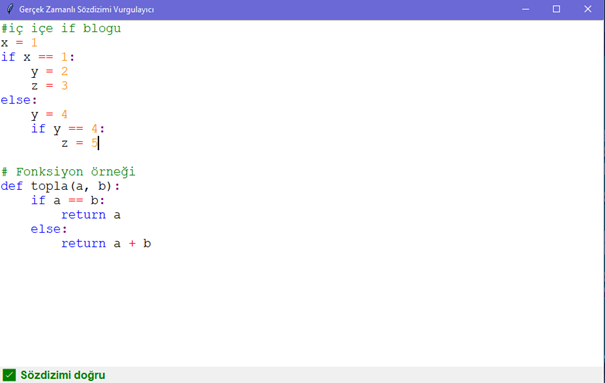
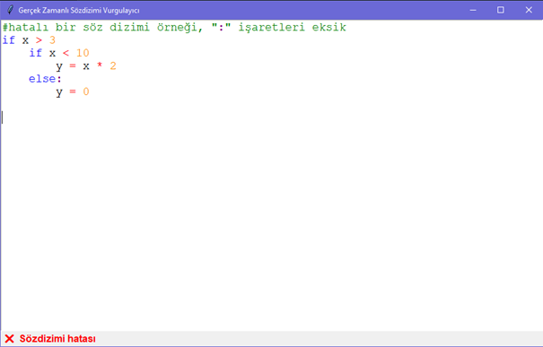

# 📝 Gerçek Zamanlı Söz Dizimi Vurgulayıcı (Python)

Bu proje, Python programlama dilinde yazılmış basit bir dil analizcisidir. Lexical analiz (lexer) ve top-down parser (üstten aşağı sözdizimsel çözümleyici) kullanılarak, yazılan kodun **gerçek zamanlı söz dizimi vurgulamasını** yapan bir arayüz sağlar.

## 🎯 Proje Amacı

Bu proje; bir programlama dili çalışması kapsamında, dilin sözdizimini tanıyan bir **lexer** ve **parser** geliştirerek, yazılan Python benzeri kodu gerçek zamanlı olarak renklendiren bir **GUI** arayüz oluşturmayı amaçlar.

---

## 🧩 Özellikler

✅ Lexical analiz (5+ token türü)
✅ Top-down sözdizimi çözümlemesi
✅ `if`, `else`, `def`, `return` gibi temel yapılar
✅ Gerçek zamanlı sözdizimi vurgulama
✅ Basit ama etkili GUI (Tkinter tabanlı)
✅ Hatalı sözdiziminde kullanıcıya anında geri bildirim

---

## 🎥 Tanıtım Videosu

Projenin nasıl çalıştığını görmek için videoyu izleyebilirsiniz:

➡️ **[YouTube Video Linki](https://youtu.be/o4OPgq9_p9o?si=2BKx9mgUi6dgu6r5)**

---

## 📝 Medium Makalesi

Projenin tüm detaylarını ve geliştirme sürecini anlattığım yazıya buradan ulaşabilirsiniz:

➡️ **[Medium Makalem: Python ile Söz Dizimi Vurgulayıcı Geliştirmek](https://medium.com/@busrayesin01/gerçek-zamanlı-sözdizimi-vurgulayıcı-dilbilgisi-tabanlı-python-projesi-8570c8589753)**

---
## 🖼️ Örnek Kod Çalıştırma Görselleri

Aşağıda gerçek zamanlı sözdizimi vurgulayıcının örnek çalıştırma görüntülerini görebilirsiniz:

### Kod Girişi


### Kod Girişi

---

## 🚀 Kullanım

1. Gerekli modülleri kurun (sadece Python standart modülleri kullanılmıştır, ek yükleme gerekmez).
2. `main.py` dosyasını çalıştırın:

```bash
python main.py
```

3. Açılan arayüzde Python benzeri kod yazın. Örnek:

```python
# deneme kodu
def hesapla(a, b):
    x = (a + b) * 3
    if x > 10:
        return x
    else:
        return (x + 5)
```

---

## 📁 Dosya Yapısı

```
├── lexer.py        # Token sınıfı ve tokenize fonksiyonu
├── parser.py       # Top-down parser sınıfı
├── main.py         # GUI ve uygulama başlangıcı
├── README.md
```

---

## 🎨 Token Renkleri

| **Token Türü** | **Renk**                                   |
| -------------- | ------------------------------------------ |
| `KEYWORD`      | <span style="color:blue;">Mavi</span>      |
| `ID`           | <span style="color:black;">Siyah</span>    |
| `NUMBER`       | <span style="color:orange;">Turuncu</span> |
| `OP`           | <span style="color:red;">Kırmızı</span>    |
| `COMMENT`      | <span style="color:green;">Yeşil</span>    |
| `COLON`        | <span style="color:purple;">Mor</span>     |
